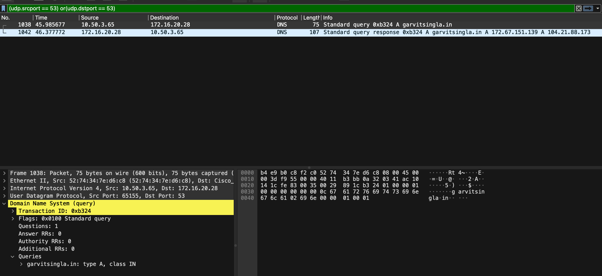

# custom nslookup in c uing unix socket API

## usage 

```bash
 make && ./nslookup <hostname> 
```

## motivation
nslookup is a command line utility that is used to resolve the dns queries by giving a hostname and returning the ip address for that address

> making this project to learn fundamentals of computer networking and socket programming

## basic working
a dns request is traditionally 512 bytes sent over UDP connection to the server's 53 port
but what the hell is dns? dns(domain name system) is a protocol to resolve domain names to ip addresses

but why not directly use domain name? because poor computers cannot interpret domain names and they need a ip address to connect to the server and do the traditional DNS resolution

dns is intself a complex infrastructure but keeping it aside, there is a UNIX utility to check the DNS resolution for a given hostname and it is called `nslookup`
this is the basic working of `nslookup`


## dns request inspection


```c
struct dns_question_format{
    uint16_t qtype; // type of question
    uint16_t qclass; // class of question
    char qname[256]; // name of question
};
struct dns_resource_record_format{
    uint16_t type; // type of resource record
    uint16_t class; // class of resource record
    uint32_t ttl; // time to live
    uint16_t rdlength; // length of rdata
    char rdata[256]; // rdata of resource record
};
struct dns_request_format{
    uint16_t id; // for a application for multiple queries
    uint16_t flags; // some flags that indicate the type of query
    uint16_t qdcount; // number of questions
    uint16_t ancount; // number of answers
    uint16_t nscount; // number of name servers
    uint16_t arcount; // number of additional records
    struct dns_question_format questions[1]; // array of questions
    struct dns_resource_record_format answers[1]; // array of answers
    struct dns_resource_record_format name_servers[1]; // array of name servers
    struct dns_resource_record_format additional_records[1]; // array of additional records
};

```

## from where i learnt?
1. beej's guide to network programming(best for socket programming) 
2. dns header and packet format 
